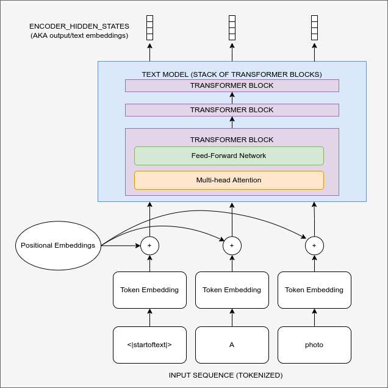

# 单元3：Stable Diffusion

欢迎来到 Hugging Face 扩散模型课程的第三单元！在这一单元，你将会遇见一个非常强大的扩散模型，名叫 Stable Diffusion（SD），我们将探索它到底能干点什么。

## 开始这一单元 :rocket:

这里分几步学习这一单元：

- 请首先确保你已经[注册了本课程](https://huggingface.us17.list-manage.com/subscribe?u=7f57e683fa28b51bfc493d048&id=ef963b4162)，以便有新的学习资料时你会被通知到。
- 请先通读本文，对本单元的重点有一个整体的认识。
- 学习 [_**Stable Diffusion Introduction**_ notebook](#hands-on-notebook) 这节笔记本，来看看SD是如何实际应用到一些常见的应用场景中的。
- 使用 [**hackathon** 文件夹](../hackathon)中的 **Dreambooth** 笔记本，微调你自己自定义的 Stable Diffusion 模型，并与社区分享，看看你能不能赢得点奖项和赠品。
- （可选）观看视频 [**Stable Diffusion Deep Dive**](https://www.youtube.com/watch?app=desktop&v=0_BBRNYInx8)并学习相关 [**笔记本**](https://github.com/fastai/diffusion-nbs/blob/master/Stable%20Diffusion%20Deep%20Dive.ipynb)，深入了解不同的组件以及它们如何发挥不同的作用。这些学习资料是为了最新的 FastAI 课程 [Stable Diffusion from the Foundations](https://www.fast.ai/posts/part2-2022.html)准备的 —— 前几课已经可以观看了，剩下的课程也会在近几个月内放出。这个课程也是对本教程的一个非常好的补充，适合任何对从零建立这些模型感兴趣的人。

:loudspeaker: 别忘了加入[Discord](https://huggingface.co/join/discord)，在这里你可以参与学习资料的讨论，在`#diffusion-models-class`频道分享你的实验成果。

## 简介

 
_示例图片，由 Stable Diffusion 生成_

Stable Diffusion 是一个强大的文本条件隐式扩散模型（text-conditioned latent diffusion model）。不要担心，我们马上就会解释这些名词。它根据文字描述生成令人惊艳的图片的能力震惊了整个互联网。在本单元，我们将会一探 SD 的工作原理并了解一下它还能搞出什么其它花招。

## 隐式扩散（Latent Diffusion）

当图片尺寸变大时，需要的计算能力也随之增加。这种现象在自注意力机制（self-attention）这种操作的影响下尤为突出，因为操作数随着输入量的增大呈平方地增加。一个 128px 的正方形图片有着四倍于 64px 正方形图片的像素数量，所以在自注意力层就需要16倍（42）的内存和计算量。这是任何需要生成高分辨率图片的人都会遇到的问题。

 
_Diagram from the [Latent Diffusion paper](http://arxiv.org/abs/2112.10752)_

隐式扩散致力于克服这一难题，它使用一个独立的模型  Variational Auto-Encoder（VAE）**压缩**图片到一个更小的空间维度。这背后的原理是，图片通常都包含了大量的冗余信息 —— 给定足够的训练数据，一个 VAE 可以学会产出一个比输入图片小得多的表征，并把这个**隐式**表征重建回原图片，同时保留较高的保真度。SD 模型中的 VAE 接收一个三通道图片输入，生成出一个四通道的隐式表征，同时每一个空间维度上都减少为原来的八分之一。比如，一个 512px 的正方形图片将会被压缩到一个 4×64×64 的隐式表征上。

通过把扩散过程引用到这些**隐式表征**而不是完整图像上，我们可以从中得到很多好处（更低的内存使用、更少的 UNet 层数、更快的生成速度...）。同时我们仍能把结果使用 VAE 中的解码器解码到高分辨率图片上来查看最终结果。这一创新点极大地降低了训练和运行这些模型的成本。

## 以文本为生成条件

在第二单元，我们展示了如何将额外信息输入到 UNet，让我们对生成的图片有了额外的控制。我们把这种方法叫做条件生成。给定一个带噪图片，我们让模型**基于额外的线索**（比如类别标签，或 Stable Diffusion 中的文字描述）去预测去噪的版本。在推理阶段，我们可以输入对期望图片的文字表述和纯噪声数据作为起始点，然后模型就开始全力对随机输入进行“去噪”，以求生成的图片能匹配上文字描述。

 
_图表：文本编码过程，即将输入的文本提示转化为一系列的文本嵌入（即图中的 encoder_hidden_states)，然后输入 Unet 作为生成条件_

为了达成这一目的，我们首先需要为文本创建一个数值的表示形式，用来获取文字描述的相关信息。为此，SD 利用了一个名为CLIP的预训练transformer模型。CLIP 的文本编码器是用来处理图像说明文字、将其转换为可以用来对比图片和文本的形式的。所以这个模型非常适合用来从文字描述来为图像创建有用的表征信息。一个输入文字提示会首先被分词（tokenize，基于一个很大的词汇库把句中的词语或短语转化为一个个的token），然后被输入进 CLIP 的文字编码器，为每个token产出一个 768 维（针对 SD 1.X版本）或1024维（针对SD 2.X版本）的向量。为了使得输入格式一致，文本提示总是被补全或截断到含有 77 个 token 的长度，所以每个文字提示最终作为生成条件的表示形式是一个形状为 77×1024 的张量。 

那我们如何实际地将这些条件信息输入到 UNet 里让它预测使用呢？答案是使用交叉注意力机制（cross-attention）。交叉注意力层从头到尾贯穿了 UNet 结构。UNet 中的每个空间位置都可以“注意”文字条件中不同的token，以此从文字提示中获取到了不同位置的相互关联信息。上面的图表就展示了文字条件信息（以及基于时间周期 time-step 的条件）是如何在不同的位置点输入的。 可以看到，UNet 的每一层都由充足的机会去利用这些条件信息！

## 无分类器的引导

然而很多时候，即使我们付出了很多努力尽可能让文本成为生成的条件，但模型仍然会在预测时大量地基于带噪输入图片，而不是文字。在某种程度上，这其实是可以解释得通的 —— 很多说明文字和与之关联的图片相关性很弱，所以模型就学着不去过度依赖文字描述！可是这并不是我们期望的效果。如果模型不遵从文本提示，那么我们很可能得到与我们描述根本不相关的图片。

 
_由描述 "An oil painting of a collie in a top hat" 生成的图片（从左到右的 CFG scale 分别是 0、1、2、10)_

为了解决这一问题，我们使用了一个小技巧，叫做无分类器的引导（Classifie-free Guidance，CGF）。在训练时，我们时不时把文字条件置空，强迫模型去学着在无文字信息的情况下对图片去噪（无条件生成）。在推理阶段，我们分别做两个预测：一个有文字条件，一个没有。我们可以用这两者的差异来建立一个最终结合版的预测，让最终结果在文本条件预测所指明的方向上依据一个缩放系数（即引导尺度）去“走得更远”，希望最终生成一个更好地匹配文字提示的结果。上图就展示了在同一个文本提示下使用不同引导尺度得到的不同结果。可以看到，更高的引导尺度能让生成的图片更接近文字描述。

## 其它类型的条件生成：超分辨率、图像修补、深度图到图像的转换

我们也可以创建各种接收不同生成条件的 Stable Diffusion 模型。比如[深度图到图像转换模型](https://huggingface.co/stabilityai/stable-diffusion-2-depth)使用一个额外的输入通道接收要被去噪的图片的深度信息。所以在推理阶段，我们就可以输入一个目标图片的深度图（由另一个独立的模型预测出来），以此来希望模型生成一个有相似全局结构的图片。

 
_基于深度的 SD 模型可以根据同一个全局结构生成不同的图片（示例来自StabilityAI)_

用相似的方式，我们也可以输入一个低分辨率图片作为条件，让模型生成对应的高分辨率图片（[正如Stable Diffusion Upscaler](https://huggingface.co/stabilityai/stable-diffusion-x4-upscaler)一样）。此外，我们还可以输入一个掩膜（mask），让模型知道图像相应的区域需要让模型用in-painting的方式重新生成一下：掩膜外的区域要和原图片保持一致，掩膜内的区域要生成出新的内容。

## 使用 DreamBooth 微调

_由 Imagen model 生成的图片，来自[dreambooth 项目页](https://dreambooth.github.io/)_

DreamBooth 可以用来微调一个文字到图像的生成模型，教它一些新的概念，比如某一特定物体或某种特定风格。这一技术一开始是为 Google 的 Imagen Model 开发的，但被很快应用于 [stable diffusion](https://huggingface.co/docs/diffusers/training/dreambooth) 中。效果十分惊艳（如果你最近在社交媒体上看到谁使用了 AI 生成的头像，那这个头像有很大概率是出自于基于 DreamBooth 的服务），但该技术也对各种设置十分敏感。所以请学习我们这一单元的笔记本，并阅读[这个对不同训练参数的调研资料](https://huggingface.co/blog/dreambooth)来获取些参考，让模型尽可能地起作用。

## 用来上手的笔记本示例

| Chapter                                     | Colab                                                                                                                                                                                               | Kaggle                                                                                                                                                                                                   | Gradient                                                                                                                                                                               | Studio Lab                                                                                                                                                                                                   |
|:--------------------------------------------|:----------------------------------------------------------------------------------------------------------------------------------------------------------------------------------------------------|:---------------------------------------------------------------------------------------------------------------------------------------------------------------------------------------------------------|:---------------------------------------------------------------------------------------------------------------------------------------------------------------------------------------|:-------------------------------------------------------------------------------------------------------------------------------------------------------------------------------------------------------------|
| Stable Diffusion Introduction                                |               |               |               |               |
| DreamBooth Hackathon Notebook                      |               |               |               |               |
| Stable Diffusion Deep Dive                               |               |               |               |               |

至此，你已经准备好学习相关笔记本了！通过上面的链接使用你选择的平台打开它们！DreamBooth 需要的算力比较多，所以如果你是用的 Kaggle 或 Google Colab，那请确保将运行时模式设为 GPU 来获得最好效果。

Stable Diffusion Introduction 这节笔记本是使用🤗 Diffusers 库对 Stable Diffusion 所作的一个简短介绍，包含了一些基本的使用管线生成和修改图片的示例。

在 DreamBooth Hackathon 这节笔记本(在 [hackathon 文件夹里](../hackathon))中，我们展示了如何使用你自己的图片微调 SD，来获取一个涵盖新的风格或内容的自定义版本模型。

最后，在 Stable Diffusion Deep Dive 笔记本中和视频中，我们分解了一个典型的生成管线中的每一个步骤，并提出了一些新奇的方法去对每一步进行修改，来有创造性地控制生成。

## 项目时间

仿照 **DreamBooth** 笔记本中的指导，针对某个特定种类的数据训练你自己的模型。请确保在提交时加入一些输出的例子，以便我们为不同的种类数据选出最好的模型！请查阅 [hackathon 信息](../hackathon)，进一步了解关于奖项、GPU额度等信息。

## 一些其它学习资源

- [High-Resolution Image Synthesis with Latent Diffusion Models](http://arxiv.org/abs/2112.10752) - 这篇论文介绍了 Stable Diffusion 背后的方法

- [CLIP](https://openai.com/blog/clip/) - CLIP 学习着去将文字和图片联系起来，CLIP 文本编码器被用来将文本提示转化为 SD 使用的信息量丰富的数值表征形式。也可查阅 [这篇关于 OpenCLIP 的文献](https://wandb.ai/johnowhitaker/openclip-benchmarking/reports/Exploring-OpenCLIP--VmlldzoyOTIzNzIz)，了解最近的一些 CLIP 开源版本（其中一个被用于第二版 SD 模型）。

- [GLIDE: Towards Photorealistic Image Generation and Editing with Text-Guided Diffusion Models](https://arxiv.org/abs/2112.10741) 是一篇较早的论文，介绍了把文本作为生成条件以及 CFG 相关内容。

如果你找到了更好的学习资源，也别忘了告诉我们让我们加到这个列表里！
